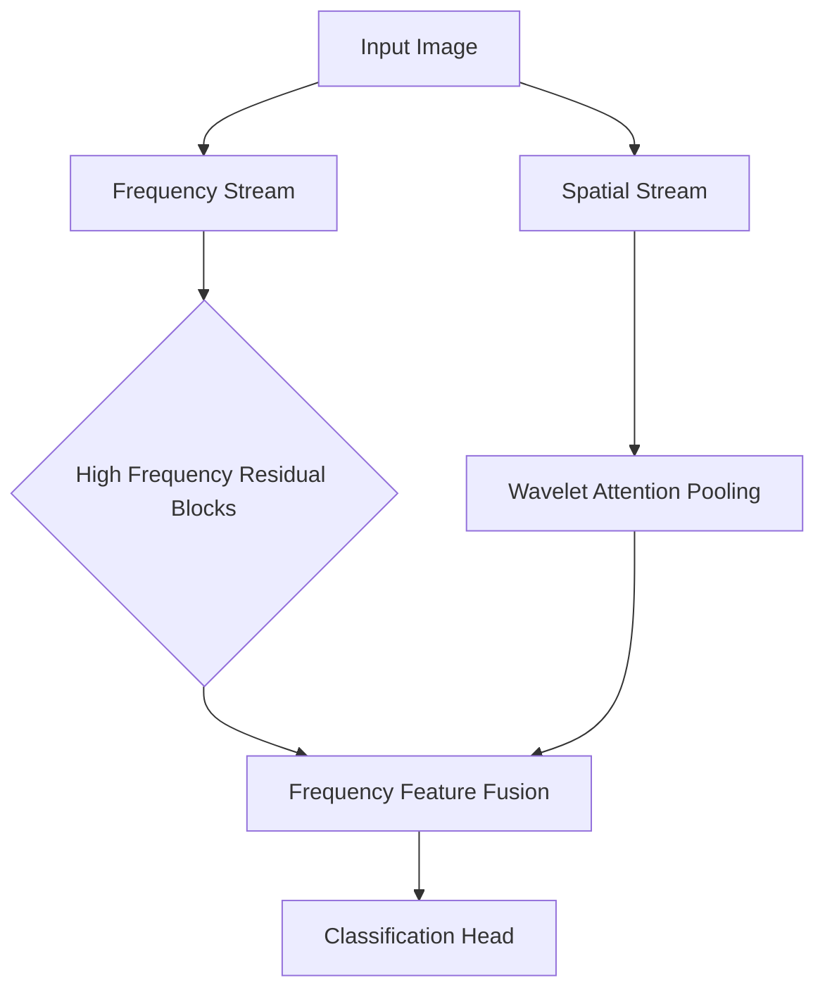

# WaveFusionNet: Hybrid Frequency-Spatial Domain Architecture for AI-Generated Image Detection


A novel deep learning architecture combining wavelet transforms and frequency domain analysis for robust detection of AI-generated synthetic images. Achieves high accuracy on CIFAKE dataset while maintaining real-time performance.

🔍 **Key Innovation**: First architecture to simultaneously process spatial features and wavelet-frequency representations through parallel processing streams.

---

## 📌 Key Features

- **Dual-Domain Processing**: Simultaneous analysis of spatial and frequency domains
- **Wavelet Attention Mechanism**: Learnable Haar wavelet decomposition with channel attention
- **Adaptive Frequency Filtering**: Custom FFT-based high-frequency residual blocks
- **Hybrid Fusion Architecture**: Combines ResNet50 backbone with novel frequency modules
- **Efficient Training**: 640 batch size optimization for large-scale image analysis

---

## 🧠 Architecture Overview

### WaveFusionNet Architecture


### Core Components
1. **Frequency Processing Stream**
   - `HFRIBlock`: High-frequency residual isolation using FFT
   - `FCLBlock`: Phase-amplitude decomposition learning
   - Adaptive frequency masking (1/4 spectrum preservation)

2. **Spatial Processing Stream**
   - Modified ResNet50 backbone
   - `WaveletAttentionStride`: Learnable wavelet decomposition
   - Channel-wise attention on HL/LH coefficients

3. **Hybrid Fusion**
   - Feature concatenation at multiple scales
   - Adaptive weighting of frequency/spatial features
   - Final classification with frequency-enhanced representations

---

## 📂 Dataset Structure
```
CIFAKE/
├── train/
│   ├── REAL/
│   └── FAKE/
├── test/
│   ├── REAL/
│   └── FAKE/
```

**Dataset Source**: [CIFAKE Dataset](https://www.kaggle.com/datasets/birdy654/cifake-real-and-ai-generated-synthetic-images)

---

## 🔄 Future Roadmap

- [ ] Multi-modal fusion with text prompts
- [ ] Diffusion model detection extension
- [ ] Browser-based inference demo
- [ ] Adaptive frequency band learning
---

## 🧩 Technical Contributions

1. **Novel Frequency Processing Blocks**
   - High-Frequency Residual Isolation (HFRI)
   - Phase-Amplitude Decomposition Learning
   - Adaptive Spectral Masking

2. **Hybrid Architecture Design**
   - Parallel Spatial/Frequency Streams
   - Wavelet-Channel Attention Fusion
   - Residual Connection Optimization

3. **Efficient Training Framework**
   - Large Batch Optimization (640)
   - Mixed-Precision Training
   - Dynamic Learning Rate Scheduling

---
